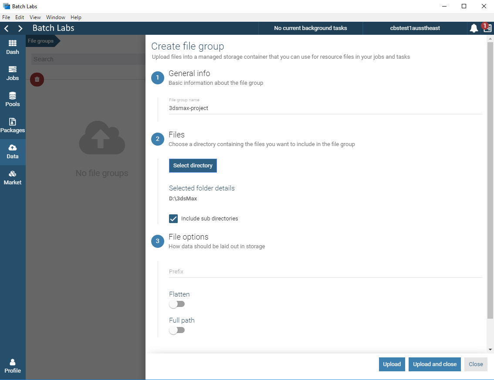
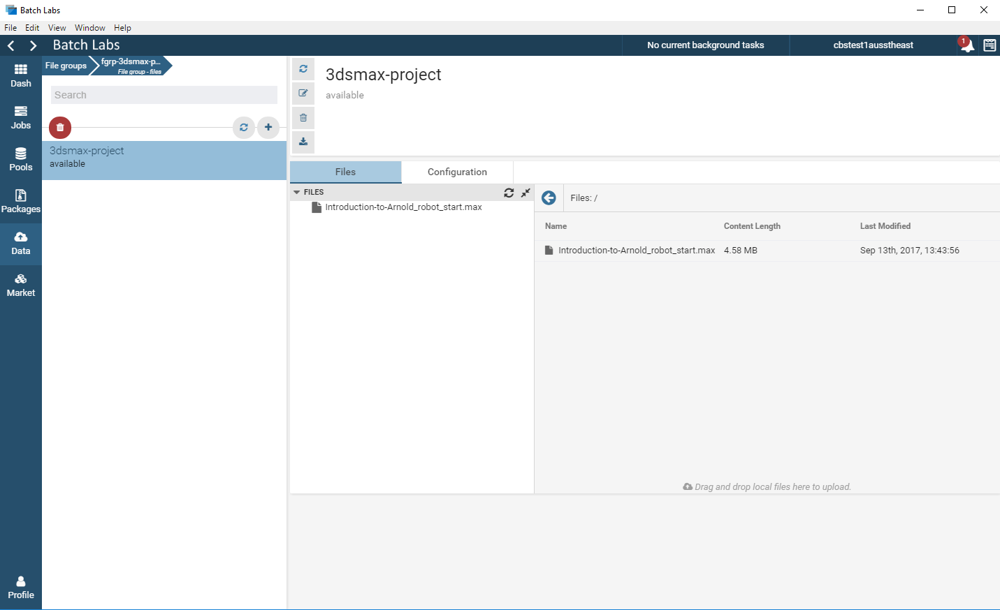
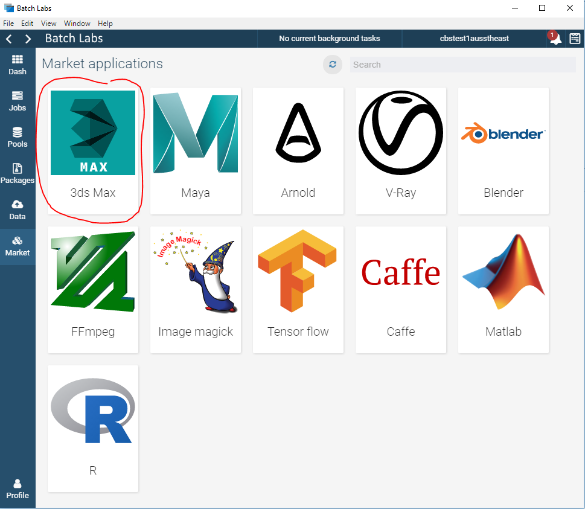
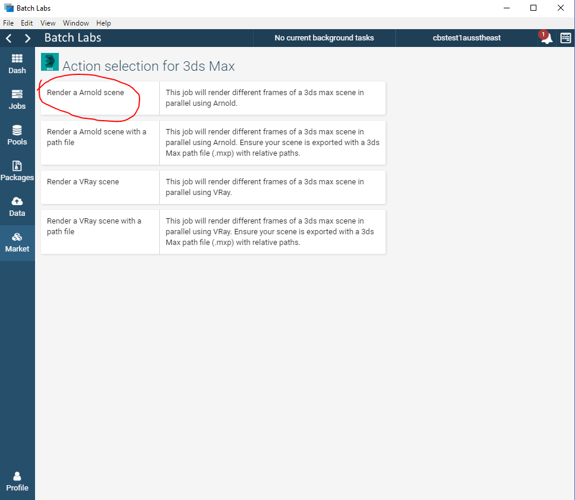
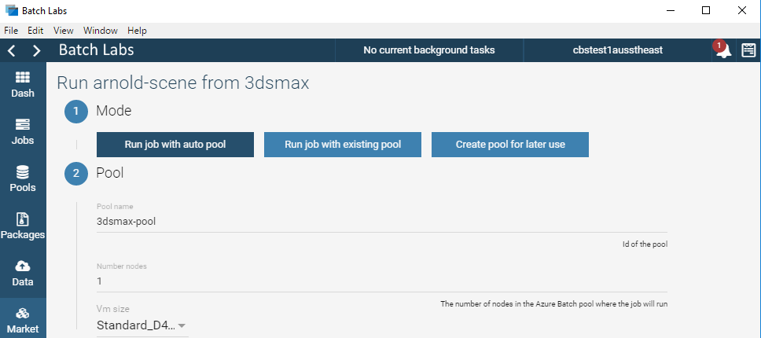
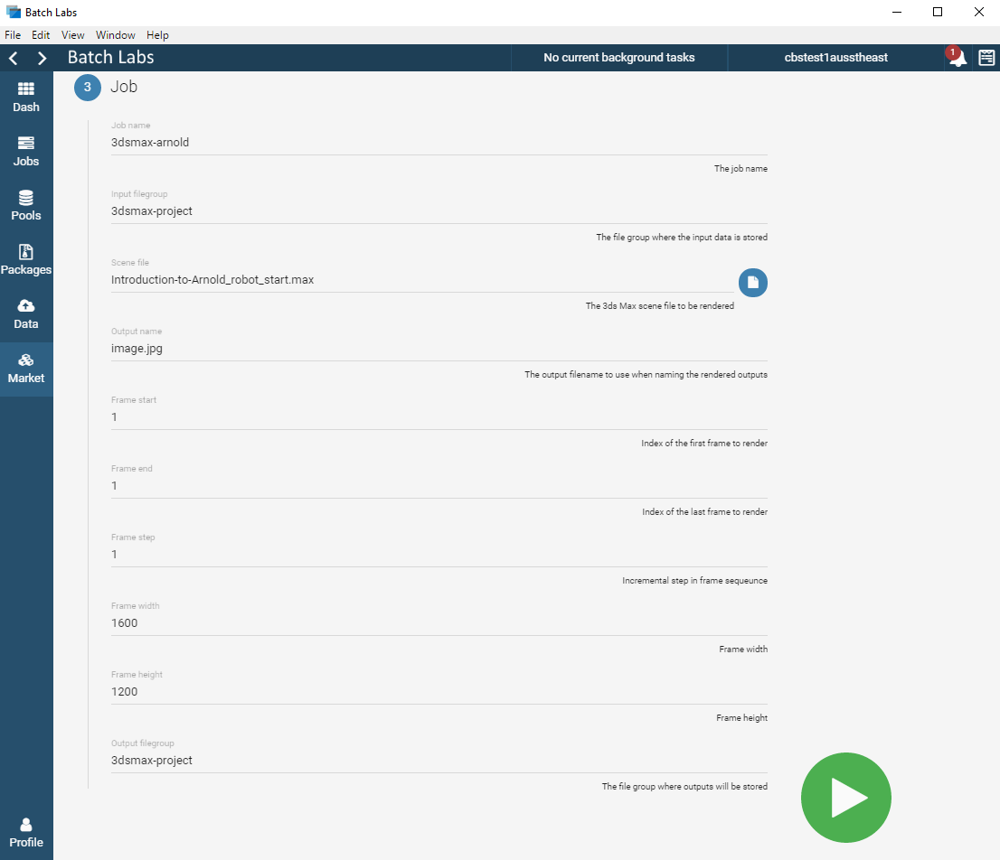
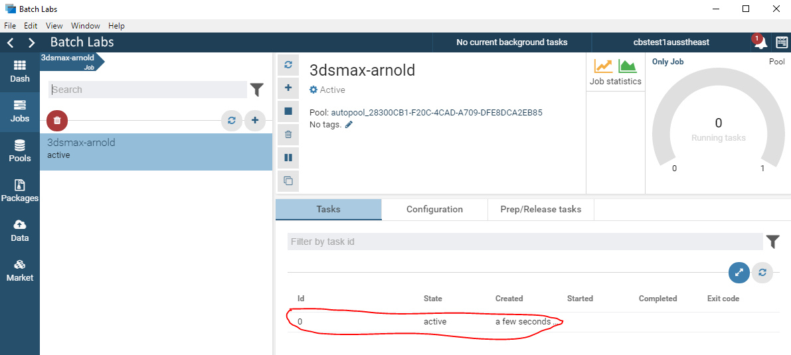
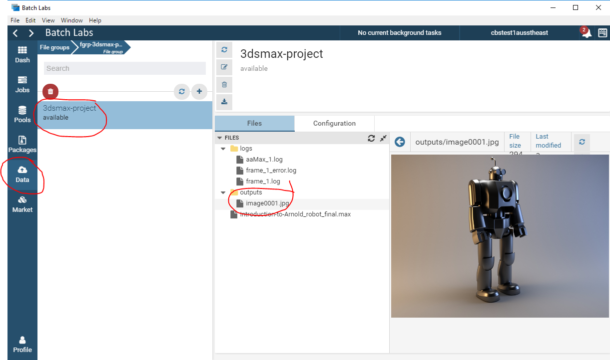

# 3ds Max Batch Labs Template

## Summary

The 3ds Max Batch Labs templates allow you to render VRay and Arnold scenes using the Azure Batch Rendering Service.  There are two variations of the template for VRay and Arnold, one for standard scenes and one for more complex scenes that require a 3ds Max path file to assets and textures (.mxp file).

For the following tutorial we'll be using the 3ds Max Arnold robot final scene provided by the Solid Angle [Introduction to Arnold for 3ds Max](https://support.solidangle.com/display/A5AF3DSUG/Introduction+to+Arnold+for+3ds+Max) tutorial.

You can download the scene directly from [here](https://support.solidangle.com/download/attachments/40665256/Introduction-to-Arnold_robot_final.zip?version=1&modificationDate=1490281794000&api=v2).

Download and extract Introduction-to-Arnold_robot_final.zip into a directory by itself.

### 1. Upload inputs to a File Group

Before you submit your job you'll need to upload you scenes input data to a file group.  

Navigate to 'Data' and click '+' to create a new file group.

Give the file group a name, this could be something like a project name for the scene.  For this example we'll use '3dsmax-project'.

Select the root folder of your assets.  If you're using a 3ds Max path file with your scene ensure the path file paths are relative and included in the correct subfolders relative to the root of your scene.

Ensure 'Include sub directories' is checked.  Under File options keep the Prefix empty, Flatten and Full path disabled.

Click 'Upload and close'.  You'll see the form close and the upload progressing under background tasks near the top of the screen.

You can view your new file group and the data in it under 'Data -> 3dsmax-project'.  Below you can see that your filegroup has a single scene file 'Introduction-to-Arnold_robot_final.max'.

### 2. Job Submission

To submit a render job with Batch Labs navigate to:

Market -> 3ds Max

Then navigate to 'Render an Arnold scene'.  See below for more details on rendering scenes with path files.

Now you need to select the pool mode.

Renders are executed on the compute nodes within a pool.  A render job can use either an existing static pool, or a auto pool that is created on demand for the lifetime of the job.

When using an existing pool for renders, ensure that the pool was created with '3dsmax' and 'arnold' or 'vray' application licenses.  If the application licenses haven't been included with a pool you will see watermarks on the render outputs.

Auto pools will use the provided template and automatically include the '3dsmax' and 'arnold' or 'vray' licenses.

For this tutorial we'll use 'Run job with auto pool'.

Give your pool a meaningful name, choose the number of compute nodes and select a compute node size.  For this example we'll use a single Standard_D2_v2 compute node which has 2 cores.

You can see more information about the various Azure virtual machine sizes [here](https://docs.microsoft.com/en-us/azure/virtual-machines/windows/sizes).

For the job name either keep the default or enter something meaningful.

For the Input Filegroup select the '3dsmax-project' that you created earlier.

Select the scene file from the filegroup and optionally select the scene path file from the filegroup if using one.

For the output name, Frame start, Frame end, Frame width and Frame height you can keep the defaults or adjust them as required.

For the output filegroup we'll re-use the existing '3dsmax-project' filegroup.  This is the location outputs are uploaded.

Click the Submit button to start the job.

### 3. Monitor your Job

At this point you can monitor the job and task(s) for completion.

Navigate to 'Jobs -> 3dsmax-render'.

Here you'll see all the job tasks and their current state.  By clicking on a task you can view its execution information and log files.  You can even terminate a task if you've made a mistake.  You can use the log files here to investigate any potential issues with the scene or render.

### 4. View and Download the outputs

When a task completes it will upload its log files and the render outputs to the output filegroup specified previously.

In this case you can navigate to the '3dsmax-project' filegroup and see the render outputs in the root of the filegroup.  You'll also find the task log files in the logs subdirectory.

Your final output should look like this.

## Rendering Scenes with Path Files

When rendering more complex 3ds Max scenes you'll often need to include a 3ds Max path file (.mxp) to ensure all assets and textures can be resolved at run time.  If using a path file ensure that all paths are relative, and map to the root of the input filegroup that you create.  For example if your path file contains 'RenderAssets=.\sceneassets\renderassets', your filegroup should contain 'sceneassets' in the root and the 'renderassets' subdirectory in 'sceneassets', assuming the .\sceneassets\renderassets folder isn't empty.

Note - Due to a bug in 3ds Max 2018 you need to ensure that the scene file being rendered is in the root of your filegroup, not in the scenes subdirectory.
