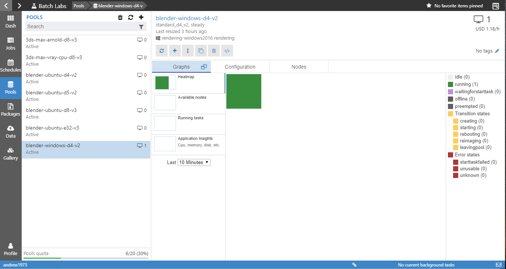

# BatchLabs Blender Templates
These JSON templates allow you to use **BatchLabs** and the **Azure Batch Rendering Service** to render your Blender scenes in the cloud.

There are two variations of the Blender templates. One is for rendering your scenes on Windows Server machines and the other for rendering on Canonical's Ubuntu Server. The basic functionality of both sets of templates is the same.

These templates are based off the **Azure CLI (command line interface) Extensions**' pool and job templates. The templates allow pools and jobs to be defined in parameterized JSON files with a format inspired by ARM templates. Once defined, job and pool templates can be run directly from the command line with the [Azure CLI](https://docs.microsoft.com/en-us/cli/azure/?view=azure-cli-latest), or from [BatchLabs](https://azure.github.io/BatchLabs/)

Please get in touch if you would like any more information regarding either BatchLabs or the Azure CLI.

## BatchLabs
BatchLabs is a tool designed to make managing your Azure Batch accounts and resources simple. The goal is to implement a great user experience that will help you debug, monitor and manage your pools, jobs and tasks. It also includes new features such as job and pool templates with the aim to simplify your Batch experience. BatchLabs is updated at least monthly with new features and enhancements. You can download it for Windows, Mac OS, and Linux from the [BatchLabs website](https://azure.github.io/BatchLabs/).

You will be prompted to upgrade periodically whenever we push out a new release. It is advised that you always install the latest version to keep up to date with all the exciting changes.

## Let's Run a Job
For the following tutorial we will be using a demo scene from the Blender website, Fishy Cat, by Manu Jarvinen (manujarvinen.com). You can download the scene [from this link](https://download.blender.org/demo/test/splash_fishy_cat_2.zip).

Download and extract splash_fishy_cat_2.zip into a directory by itself in a handy location.

#### 1. Start BatchLabs
If you haven't already, download and install the latest version from the [BatchLabs website](https://azure.github.io/BatchLabs/).

The first time you open BatchLabs you will be prompted to log in. Use the same credentials that you would use for the [Azure Portal](http://portal.azure.com). If this the first time you have ever tried to use Azure, you will need to sign into the portal first and create a subscription and a Batch account.

Please get in touch if this your first time using Azure and you need a hand to get set up.

After a successful login you will see something like the following. Depending on how many Azure subscriptions you have, it may take a moment to load all the accounts.


After the accounts have loaded, you can select the account you want to use. If you have lots of accounts, you can also add certain accounts as favorites by clicking on the star to the right of the account name. This will allow you to quickly swap between accounts using the account quick select.


#### 2. Open the Blender Template
Go to the ``Gallery`` section by clicking on the ``Gallery`` icon from the LH navigation menu. You will see something like the following:


The Gallery is the UI visualization of all of our custom JSON templates that can be found in the [GitHub template repository](https://github.com/Azure/BatchLabs-data/tree/master/ncj). We are adding to and enhancing these templates all the time. Once you get more familiar with job and pool templates, feel free to download and modify the templates should you wish.

Any job or pool template on your local machine can be run in BatchLabs using the ``Local Templates`` option from this screen.

Click on the ``Blender`` icon, then depending on if you want to use Windows or Linux machines select the option. There is no real difference between the 2, the Linux template installs Blender on the fly as the nodes are created in the pool; whereas the Windows template uses a pre-installed version of Blender 2.79 on our custom rendering image.


For this demo, I am going to use the Windows template, so I select the ``Render movie on Windows Server`` option.

#### 3. Select the Action

Now we need to decide what action we are going to take. BatchLabs uses the templates to provide you with a standard form to help you enter the parameters for the job and pool. You will be presented with 3 options:


**Run a job with an auto-pool**\
Jobs can use an auto-pool that is created when the job is submitted and deleted when the job completes. These can be handy for fire and forget jobs, but while getting to know the system I always recommend using a pre-existing pool rather than an auto-pool, as task failures are much easier to debug while the pool and nodes are still alive.

**Run a job with a pre-existing pool**\
This is the simplest way to get up and running. You simply select the pool you want the job to run on from a list of pre-existing pools. You can submit more than 1 job to your existing pool and they will all be processed when nodes become available. If you need more nodes in the pool, then just select: ``Pools -> <your-pool-name>`` and click on the scale button to increase the number of compute nodes. We will go into this in more detail later in the demo.

**Create a pool for later use**\
Create a new pool with 1 or more nodes to run your job on. Once a pool is created, you don't have to delete it in-between jobs. You can just use BatchLabs to rescale the pool down to 0 nodes and you will no longer pay for any compute node uptime. Next time you want to run a job, just select: ``Pools -> <your-pool-name>`` and click on the scale button to re-scale the pool up again with new compute nodes. If you contact us we can help you with an auto scale formula that will scale up when new jobs are submitted to the pool, and automatically scale down again once the jobs have completed.

#### 4. Create a Pool
If you have not yet created a pool to run your job on, we can do that now. Rendering jobs need to be run on the correct type of pool that matches the defined pool template. Only a pool that was created with the correct Blender template will work. Click on the ``Create pool for later use`` button and you will see the following form:


- Enter a pool name, or leave the default which will be: ``blender-windows``. I like to add the node type to the name as well so I can easily see what pool I want to use for a given job. In this case we will call it ``blender-windows-d3-v2`` as we will be using [Standard_D3_v2](https://docs.microsoft.com/en-us/azure/virtual-machines/windows/sizes-general#dv2-series) 4-core instances.

- Choose the number of dedicated and low-priority compute nodes, the template defaults to 1 dedicated node, but you can add more if you wish. For very large jobs we can select virtually any number of compute nodes. Any new Batch account will have a default Quota of 20 dedicated and 20 low-priority cores. If you are using 4 core machines, you can create a pool with up to 5 dedicated and 5 low-priority compute nodes should you wish. Note that you will pay for the time the compute nodes are running. You can send in a support request to have your Azure Batch quota increased should you wish. Quota increase requests can be raised from the [Azure Portal Support Page](https://portal.azure.com/?feature.customportal=false#blade/Microsoft_Azure_Support/HelpAndSupportBlade/newsupportrequest)

- Select a compute node size. For this example, we'll use a single [Standard_D3_v2](https://docs.microsoft.com/en-us/azure/virtual-machines/windows/sizes-general#dv2-series) compute node which has 4 cores. You can see more information about the various Azure Compute Node sizes [here](https://docs.microsoft.com/en-us/azure/virtual-machines/windows/sizes).

Check the ``Do not redirect`` checkbox and then click on the big green button and your pool will be submitted to the Batch service for creation.

**Note:** the soon to be released version of BatchLabs will no longer display the ``Do not redirect`` checkbox. It now uses a smarter method of deciding if you want to be redirected to the pool details page.

#### 5. Submit your Job

After successfully submitting the create pool request, if you were not automatically redirected back to the job submission form, click on the ```Run job with existing pool``` button where you will be presented with the following form:


Enter the following information into the submission form:

**5.1 Select the Pool**\
In the soon to be released version of BatchLabs, if you just created a pool, then it will be automatically selected for you. If not, select your pool from the list. In our case this will be called: ``blender-windows-d3-v2``.

**5.2 Job Name**\
For the ``Job name``, enter something meaningful. **Note that each job within a given Batch account must have a unique name.** You will get an error should you re-use a job ID more than once. A suggestion would be to name the job after the scene you are rendering, in this case we will call the job: ``fishy-cat-01``. I normally add an incrementing number to the job in case I want to tweak anything and run it again. Next time I can name the job ``fishy-cat-02`` and there will be no issues with duplicate job names.

**5.3 Input Data**\
Click on the ``Input data`` field and select ``Create a new file group`` or select the name of the file group that contains your input data if you have created one already.

- Enter the name for the file group, in this case: ``fishy-cat``
- Locate the folder that contains the extracted fishy cat scene files and drag and drop it onto the ``File or directory path`` textbox.


- Make sure ``Include sub-directories`` is checked and click ``Create and close``.

While the uploads are processing, you can use the ``background task monitor`` to monitor the upload progress.


Once the files have been uploaded, the form will close and you can select ``fgrp-fishy-cat`` from the options list.

**Note:** The current version of BatchLabs fails to use the correct file group name and it may not be populated automatically. This has been fixed and will be released shortly.

**5.4 Blend File**\
Click on the button to the right of the ``Blend file`` field and browse to the main ``blend`` file for your scene. This will load the files from your input file group.


**5.5 Options Parameters**\
Should you wish you can add additional ``Optional Parameters`` that will be passed to Blender via the command line. The list of which can be [found here](https://docs.blender.org/manual/en/dev/advanced/command_line/arguments.html).

**5.6 Frame Start and End**\
``Frame start`` and ``Frame end`` can either define a frame range, or you can just enter a single frame number in each to only render that frame. Each frame will have its own task created within the job. In this case we will only render 1 frame so just leave the default values in place.

**5.7 Outputs**\
Select the ``Outputs`` file group. This is a file group that any job outputs will be written to including the logs for the job. I would suggest using a different file group for each of your scenes. You can run the same scene job multiple times using the same file group. This makes it easier to keep track of where your outputs are. Each job will upload files to a folder in the file group named with the ID of the job.

To create a new empty file group, select the ``Outputs`` form field and select ``Create a new file group`` from the drop-down items. Enter the name of the file group, in this case we can call it ``fishy-cat-outputs`` and check the ``Create an empty file group`` checkbox. Then click ``Create and close``. Once the form window closes, select the file group from the list.


**Note:** The current version of BatchLabs fails to use the correct file group name and it may not be populated automatically. This has been fixed and will be released shortly.

**Note:** While getting started, I would never recommend using the same file group as you used for your scene assets. Output images and log files are uploaded from each of your tasks, if you had used the same input file group for your outputs, the next time you re-ran the job, these outputs would be downloaded to the compute node with the rest of your input files, whereby possibly affecting task runtime performance. There is a way we can do this should you wish, so please get in touch and we can let you know how to alter the template to allow this to happen.

**5.8 Submit**\
Once all mandatory fields have been filled in, the submit button will be enabled and you can click on the green button to submit the job. If the ``Do not redirect`` checkbox is visible and checked, you can uncheck this now before submitting. Your form should look like the following:


#### 6. Watch the Job Running
Once successfully submitted, you will be taken to the job details page where you can view the progress of the job.


From here you have access to all the information about the job. You can see the list of tasks, in this case there is only 1. The graph in the top right will detail how many tasks are running, succeeded, or have failed.


You may need to click the refresh button for the task status information to be updated. Though the ``running tasks`` count will tell you what is running and when it has completed. The status below the job name will also update once the job has completed. We do not automatically poll running tasks as there can be thousands of them which could potentially result in performance issues.

Once completed, click on the task, though there is nothing stopping you clicking on the task while it is still running. The default task view will show you any files on the compute node from the task. They will include any input, or output files generated by running the task.

Here you can see the successfully rendered output image for the frame:


Should your task fail, the ``stdout.txt`` and ``stderr.txt`` files will contain useful output from the task operation that will probably lead you to the cause of the issue.

**Note:** Once the node the task ran on is restarted or removed from the pool, you will no longer be able to see any task files from this view.

#### 7. Persisted Outputs

As you setup an output file group earlier, when you submitted the job, all output files from the task are uploaded to this storage container. You can access this container by clicking on: ``Data -> fgrp-fishy-cat-outputs``.


And that's about it. Your job has completed and the outputs are persisted to Azure Storage. If you have any queries or questions. Please get in touch at Azure Batch Rendering <rendering [at] microsoft.com>, and we will be happy to help you out.

#### 8. Epilogue

For a further exercise, the fishy cat scene is made up of 100 frames. Go back and submit another job: ``fishy-cat-02`` and give it the frame range of 1 to 40 (or something smaller). Then submit the job again. I am going to render all 100 frames, but don't feel like you need to.

There is no need to upload the input data again, just select the ``fgrp-fishy-cat`` file group again and select the blend file. If you want to modify the ``.blend`` scene file, then just select the file group from the ``Data`` menu and then upload the modified files. Only files that have been modified will be uploaded again. Any unchanged files will be ignored.

The first task will start straight away as you have 1 node running in the pool. This is fine if you want it to take a couple of hours, but why not re-scale the pool to utilize the full potential of Azure?

Go to: ``Pools -> blender-windows-d3-v2`` to view your pool. You will see the current heatmap and there should be a single green box that represents a single running node in the pool.



Click the scale button:


And you will see a form like this:


Depending on your account quota we can increase the number of nodes in the pool. If you have the standard 20/20 dedicated/low-priority quota that all new Batch accounts start with, we can add up to 5 dedicated and 5 low-priority nodes to the pool.

I am going to increase to the maximum default quota, but feel free to only scale up to 4 or 5 nodes.

Enter your desired quota in to the form and click ``save``, you will see a confirmation message that the pool rescale has started.

As new nodes come online in the pool, you will see new nodes appearing in the heatmap as well as more and more simultaneous tasks being processed in your job.

To make switching between job and pool easier, you can right click on your pool/job/file-group in the LH list and select ``Pin to favorites``. This allows you to quickly shift between your current favorites.

Here you can see my 2 favorite items as well as my new low-priority nodes starting up. I know they are low-priority as there is cross-hatching on the nodes in the heatmap. The node name also ends in ``-p``


Low priority nodes are a much cheaper option, but they are not guaranteed to exist for the full lifetime of your job. They can be pre-empted at any time if we have a higher priority job for them elsewhere. This is why a mixture of dedicated and low priority nodes can be a good idea in your pool.

Just about all of the nodes are now up and running. 5 dedicated and 5 low-priority nodes for a little over $4 USD an hour.


Now here is our job really steaming along with 10 tasks running at the same time.


Given each frame takes about 1 minute and 40 seconds to render on a quad-core machine, for me to render all 100 frames of this job in serial would take about 166 minutes, or a bit over 2 and a half hours.

Now that I am running 10 frames at a time it will take around about 17 minutes for all 100 frames to render, give or take a little for node start up time. Given faster machines we could render this much faster.

Here are all the output images in the file group we selected for the outputs to be saved to. You could now use an application like ``ffmpeg`` to turn these output frames into a movie.


**Note:** When you are done, go back to ``Pools -> blender-windows-d3-v2``, or select ``blender-windows-d3-v2`` from the favorites menu and scale the pool down to 0 nodes. Once scaled down, you will no longer pay for any node uptime.

If you have any queries or questions. Please get in touch at Azure Batch Rendering <rendering [at] microsoft.com>, and we will be happy to help you out.
