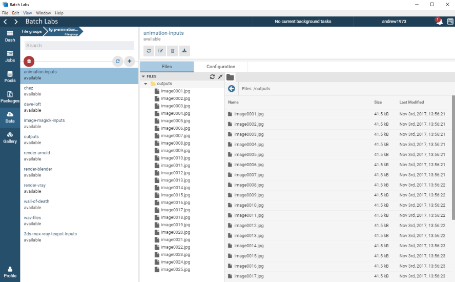
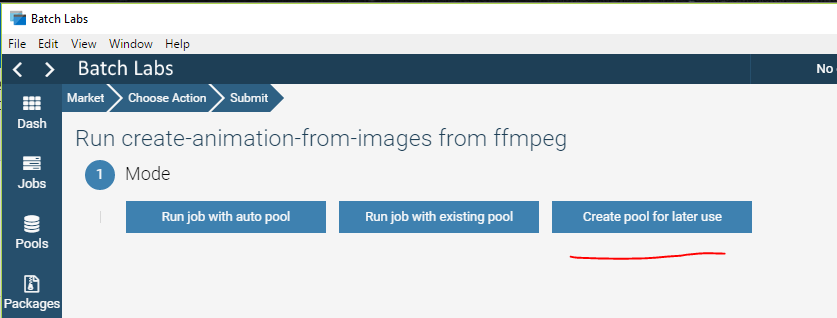
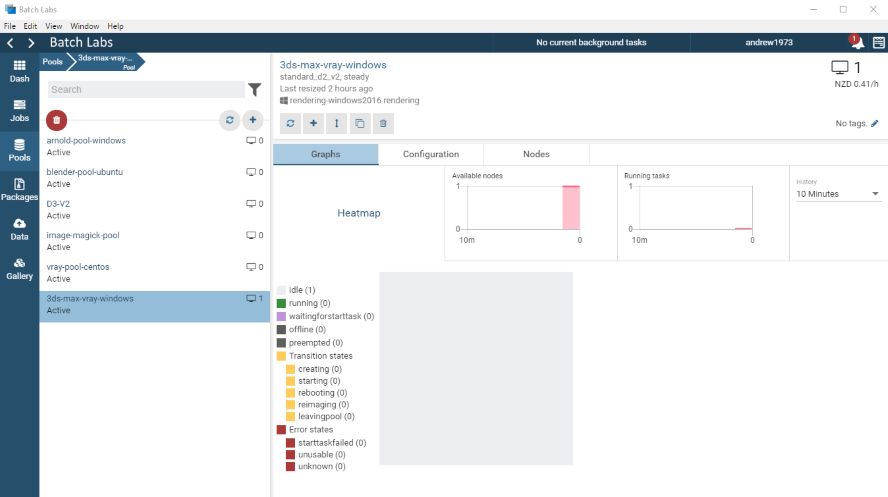
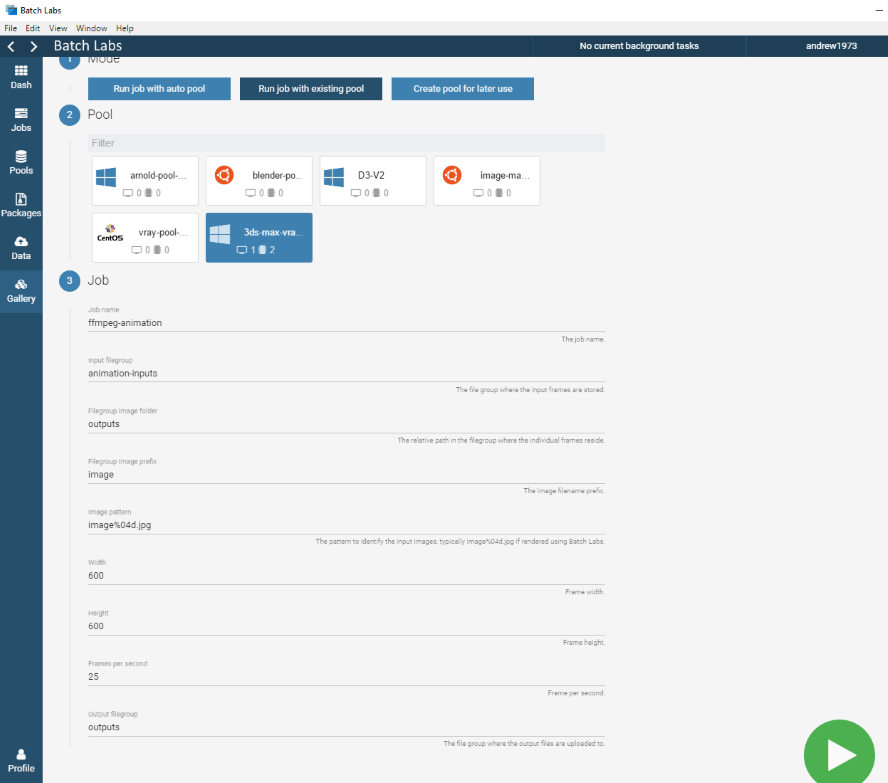
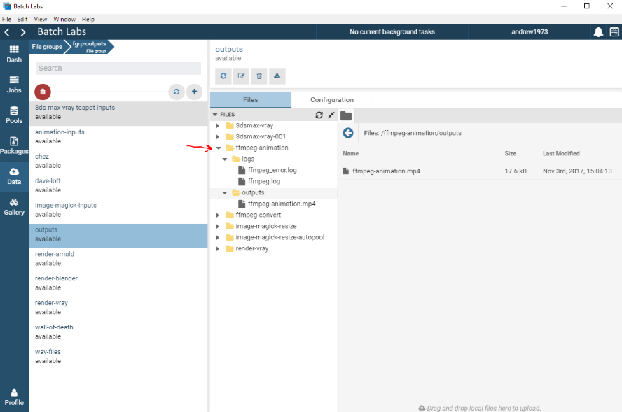

# FFmpeg Template

## Summary

FFmpeg is a complete, cross-platform solution to record, convert and stream audio and video.

The FFmpeg templates provide a quick and easy demonstration of how you can leverage the power of the Azure Batch Service to run parallel workloads in the cloud. In this demonstration we will be using FFmpeg to create an animation from a collection of rendered frames. 

The frames were rendered using 3ds Max and the V-Ray renderer from [this template](https://github.com/Azure/BatchLabs-data/tree/master/ncj/3dsmax/vray-scene), that can be found by selecting the 3ds Max application from the 'Gallery' menu and selecting the 'VRay CPU - Render a scene' action.

The source files were from [here](https://docs.chaosgroup.com/display/VRAY3MAX/Rendering+an+Animation+with+Moving+Objects).

This NCJ template uses the '[taskCollection](https://github.com/Azure/azure-batch-cli-extensions/blob/master/doc/taskFactories.md#task-collection)' task factory. This means that we explicitly define the tasks that are to be created for the job. You can learn more about the different types of task factories [here](https://github.com/Azure/azure-batch-cli-extensions/blob/master/doc/taskFactories.md).

### 1. Upload inputs to a File Group

Before you submit your job, you will need to upload your input images to a file group. You can do this from either the file group selector in the job parameters form, or by going to the "Data" menu and creating a new file group.
    
#### From the file group selector
From the file group selector, click on the "Create a new file group" option in the drop-down list and follow the steps below.

#### From the Data menu

Navigate to 'Data' and click '+' to create a new file group.

Give the file group a name, for this example we'll use 'animation-inputs'.

Select the folder that contains your images.

Ensure 'Include sub directories' is checked. Under 'File options', keep the 'Prefix' empty, 'Flatten' and 'Full path' disabled.

Click 'Upload and close'. You will see the form close and the upload progressing under the background tasks near the top of the screen.

You can view the new file group and its files under 'Data -> animation-inputs'.

### 2. Job Submission

To submit a FFmpeg animation job with Batch Labs, navigate to:

Gallery -> FFmpeg

Then navigate to 'Create animation from images'.

Now you need to select the pool mode.

Tasks are executed on compute nodes within a pool.  A job can use either an existing static pool, or an auto pool that is created on demand for the lifetime of the job. When using an existing pool, ensure that the pool was created with the 'Create pool for later use' option for this application.

Although using auto pools is more efficient cost wise, we would recommend using a pre-existing pool while you are testing out a new template as this will help you diagnose issues easier than with an auto pool. Auto pools are deleted as soon as the job completes which will make finding any issues more complex. You can run any number of jobs on an existing pool.

Auto pools and pools created with the 'Create pool for later use' option will use the provided pool template and automatically use the correct image type.

For this tutorial we will use the 'Run job with existing pool' option.

#### Create pool for later use

Select the 'Create pool for later use' button from the template home page.

Give your pool a meaningful name

Leave the number of compute nodes at the default of 1. The animation is only a single task, so it only requires a single compute node.

Select a compute node size, the default value of Standard_D2_v2 will be fine. You can see more information about the various Azure virtual machine sizes [here](https://docs.microsoft.com/en-us/azure/virtual-machines/windows/sizes).

Click the submit button and your pool will be created. You can monitor the state of your pool from the pool overview page at: Pools -> pool-name

#### Run job with existing pool

Now that the pool has been created, we can submit the job using the job template. Click on the 'Run job with existing pool' button and select the pool that you just created as the pool that the job will be run on.

For the job name, either keep the default or enter something meaningful. If you run this template more than once you will need to change the name or you will get an error submitting the job as the job name needs to be unique within the context of your Batch account. Just append -001, -002, ... to it.

For the Input file group, select the 'animation-inputs' file group that you created earlier.

Enter the relative path/folder in the filegroup where the individual frames reside. This defaults to 'outputs', so inside the main file group container you have an 'outputs' folder where the images reside.

Enter the image prefix. This is a prefix that is used to filter the images in the input file group folder. You can learn more about using the prefix [here](https://github.com/Azure/azure-batch-cli-extensions/blob/master/doc/inputFiles.md#referencing-input-data).

Enter the image filename pattern, the default is: 'image%04d.jpg', this means that each image file is padded with 4 numerical values. In my case, image0001.jpg, image0002.jpg, image0003.jpg, ... etc. Any outputs from 3ds Max normally have a format like this.

Enter the width and height of the movie, this would correspond to the format of the individual frames. In my case it is 600 x 600 pixels.

Enter the frames per second, the default is 25.

For the output file group, we will re-use the existing 'animation-inputs' file group.  This is the location that any specified output files and logs are uploaded to. I would generally have a file group called 'outputs' that I use as a default output container. All outputs from this job will be uploaded into a folder within this file group with the name of the job.

Click the Submit button to start the job.

### 3. Monitor your Job

At this point you can monitor the job and task(s) for completion. The job template creates a single task called 'ffmpeg' that takes the input images and coverts them into an MP4 movie.

The job shouldn't take too long to complete depending on the size and number of images you are converting.

Navigate to 'Jobs -> ffmpeg-animation', or whatever you called your job.

Here you will see all the task and its current state. By clicking on the task, you can view it's execution information and log files.  You can even terminate the task, or the entire job, if you have made a mistake. You can use the log files here to investigate any potential issues with the task.

Once the job has completed successfully, you can delete the pool should you choose by going to the job details and clicking on the delete button. The job will not be affected by deleting the pool.

### 4. View and Download the outputs

When the task completes, it will upload its log files and any outputs to the specified file group. Navigate to the 'animation-inputs' file group, or the output file group that you selected in the job submission form. 

You should see the movie in the 'outputs' folder. You cannot preview it from within Batch Labs, but you can download it to your local machine.
