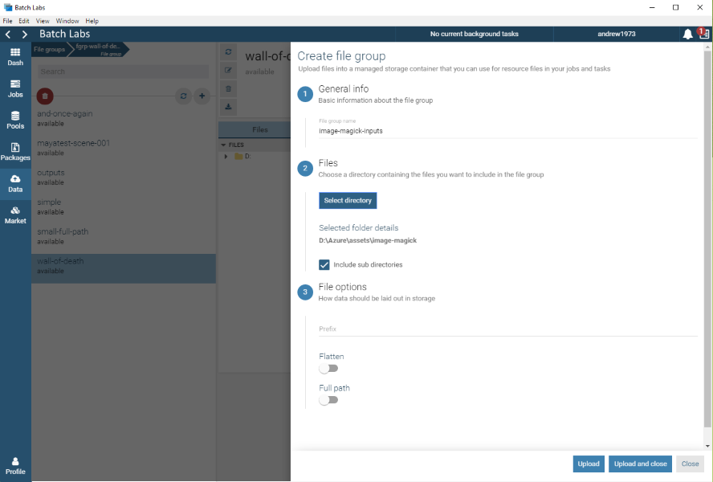
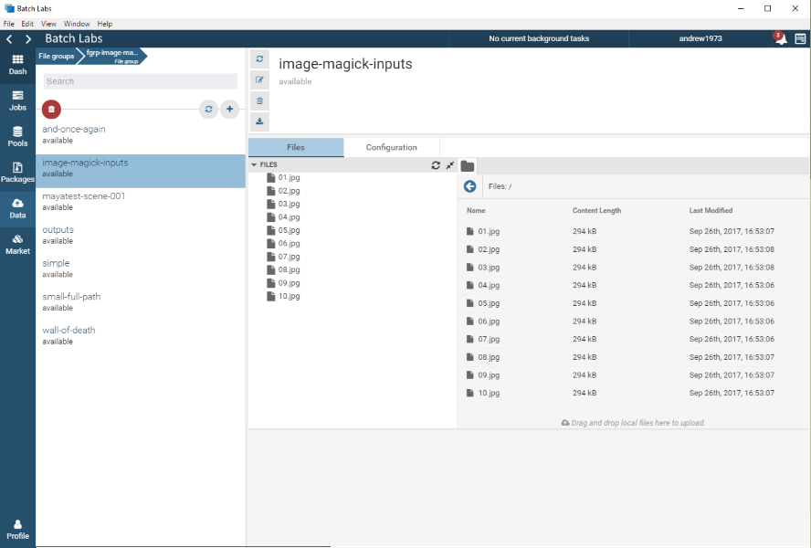
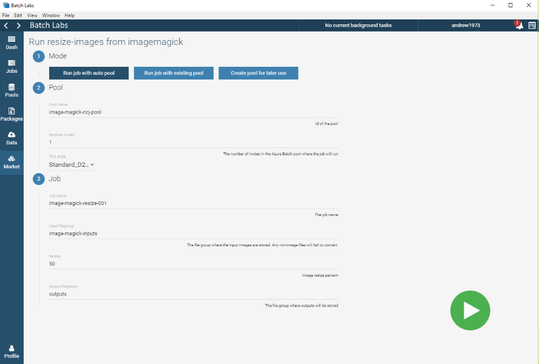

# ImageMagick Batch Labs Template

## Summary

The ImageMagick templates provide a quick and easy demontration of how you can leverage the power of the Azure Batch Service to run parallel workloads in the cloud. In this case we can resize a container of images over multiple VM's.

### 1. Upload inputs to a File Group

Before you submit your job you'll need to upload your input images to a file group.  

Navigate to 'Data' and click '+' to create a new file group.

Give the file group a name, for this example we'll use 'image-magick-inputs'.

Select the root folder that contains your images.

Ensure 'Include sub directories' is checked.  Under File options keep the Prefix empty, Flatten and Full path disabled.

Click 'Upload and close'.  You will see the form close and the upload progressing under the background tasks near the top of the screen.

You can view your new file group and the data in it under 'Data -> image-magick-inputs'.

### 2. Job Submission

To submit a ImageMagick resize job with Batch Labs, navigate to:

Market -> Image Magick

Then navigate to 'Resize a collection of images'.

Now you need to select the pool mode.

Tasks are executed on the compute nodes within a pool.  A job can use either an existing static pool, or an auto pool that is created on demand for the lifetime of the job. When using an existing pool, ensure that the pool was created with a 'Graphics and rendering' image.  Image Magick is included by default with the Azure Batch rendering images.

Auto pools and pools created with the 'create pool for later use' option will use the provided pool template and automatically use the correct image type.

For this tutorial we'll use 'Run job with auto pool'.

Give your pool a meaningful name, choose the number of compute nodes and select a compute node size.  For this example we'll use a single Standard_A2 compute node which has 2 cores. By default your Batch account has a default hard limit of 20 cores so you can select up to 10 nodes in the pool. Depending on the numder of images you want to resize, these operations take very little CPU time so for the purpose of this exercise you only need to have 2 or 3 nodes in the pool to run the job on.

You can see more information about the various Azure virtual machine sizes [here](https://docs.microsoft.com/en-us/azure/virtual-machines/windows/sizes).

For the job name either keep the default or enter something meaningful.

For the Input Filegroup select the 'image-magick-inputs' filegroup that you created earlier.

Enter the percentage you would like the images resized by. In this instance we are entering 50, as in reduce in size by 50%.

For the output filegroup we'll re-use the existing 'image-magick-inputs' filegroup.  This is the location output images and logs are uploaded to. I would generally have a filegroup called outputs that i use as a default output container. All outputs from this job will be uploaded into a folder within this filegroup with the name of the job.

Click the Submit button to start the job.

### 3. Monitor your Job

At this point you can monitor the job and task(s) for completion.

Navigate to 'Jobs -> image-magick-resize', or whatever you called your job.

Here you will see all the job's tasks and their current state. By clicking on a task you can view its execution information and log files.  You can even terminate a task, or the entire job, if you have made a mistake. You can use the log files here to investigate any potential issues with the task.

### 4. View and Download the outputs

When a task completes, it will upload it's log files and the resized outputs to the output filegroup specified previously.

In this case you can navigate to the 'image-magick-inputs' filegroup and see the resized images in the folder that matches the job's name. You will also find the task log files in the logs subdirectory.

The output files will look the same as the inpurt files, only they will be 50% smaller than the ones you uploaded.
